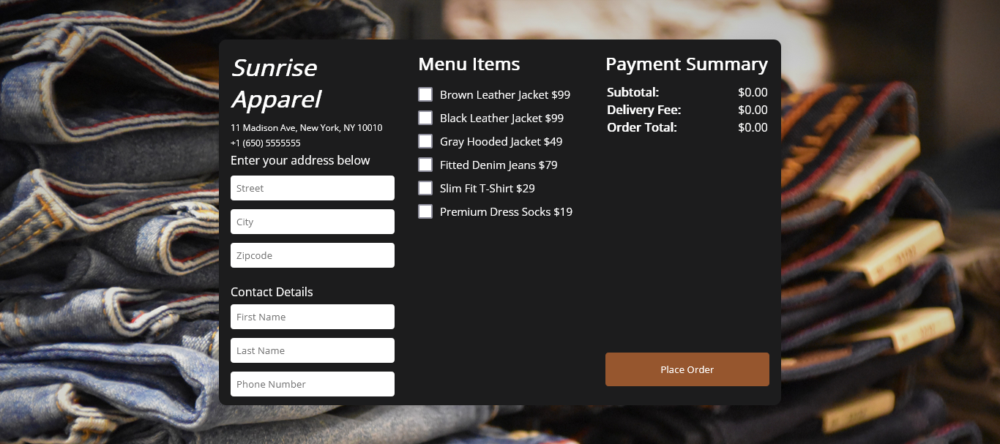

<h1>Sunrise Apparel</h1>

<h2>A clothing delivery app created using Javascript, Node, and Express.</h2>

This website created using Javascript, Node, and Express to input your information, select items to purchase, the amount gets added and get an order confirmation. This project uses the Doordash Drive API. I created this following the tutorial of Brian Design. Screenshot of the website.

- Live Site: [Sunrise Apparel](https://floating-taiga-58935.herokuapp.com/)

### Screenshot

